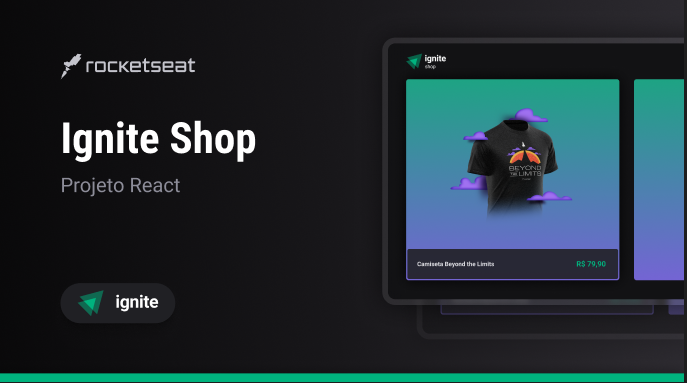

## Ignite Shop

O Ignite Shop é uma aplicação desenvolvida durante o 4º módulo da trilha React do Ignite Rocketseat. O projeto aplica a implementação do framework Next.Js com Stitches e Stripe para construir uma plataforma de vendas.

## 🛠️ Nesse projeto foi utilizado
* Next.Js
* Stitches
* Typescript
* API do Stripe